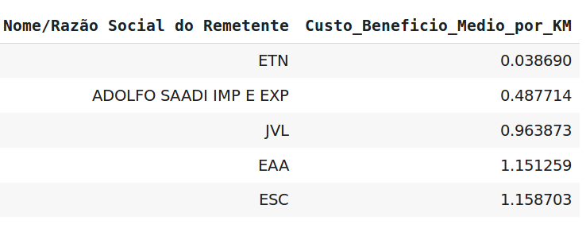

# Case Ibama
O objetivo deste case é encontrar qual transportadora realizou o transporte de madeira com maior custo-benefício e construir um modelo preditivo que prevê o preço do transporte em dezembro de 2007 por transportadora utilizando as variáveis do problema.

O dataset utilizado corresponde apenas aqueles com origem no estado do Acre e no ano de 2007. O dataset pode ser baixado no link abaixo.

[http://dadosabertos.ibama.gov.br/dataset/documento-de-origem-florestal-dof-transportes-de-produtos-florestais](http://dadosabertos.ibama.gov.br/dataset/documento-de-origem-florestal-dof-transportes-de-produtos-florestais)

# Melhor Custo Beneficio

Foi definido 3 tipos de custo beneficio:

- *custo_beneficio*: Razão entre o valor cobrado e o produto entre a distância da entrega e o volume da mercadoria;

- *custo_beneficio_por_KM*: Razão entre o valor cobrado e a distância da entrega;

- *custo_beneficio_por_Volume*: Razão entre o valor cobrado e o volume da mercadoria;

> Obs.: Aqui não estou levando em considerção o tipo de madeira que é transportada. Existem maderias que são mais valorizadas que outras. Para realizar essa analise, teriamos que ter uma base de dados com tais informações.

## Custo beneficio médio de cada empresa.

O que seria este custo beneficio médio? 

- *Custo_Beneficio_Medio*: Podemos interpretalo como a taxa média do valor cobrado do frete em que cada empresa cobraria por kilometro rodado e por volume transportado. 

- *Custo_Beneficio_Medio_por_KM*: Podemos interpretalo como a taxa média do valor cobrado do frete em que cada empresa cobraria por kilometro rodado. 

- *Custo_Beneficio_Medio_por_Volume*: Podemos interpretalo como a taxa média do valor cobrado do frete em que cada empresa cobraria por volume transportado. 

## As 5 Empresas com melhor custo beneficio

> **Custo beneficio médio por Volume**

Se escolhermos o custo beneficio como 
$$\frac{Custo}{Volume},$$
estas seriam as empresas mais indicadas.

> **Custo beneficio médio por KM**

Se escolhermos o custo beneficio como 
$$\frac{Custo}{Km},$$
estas seriam as empresas mais indicadas.

> **Custo beneficio médio por KM e Volume**

Se escolhermos o custo beneficio como 
$$\frac{Custo}{Km*Volume},$$
estas seriam as empresas mais indicadas.

# Modelo Preditivo

> O dataset tem mais de 200 transportadoras, no modelo vamos considerar as 10 empresas que realizaram maior quantidade de entregas e as demais vamos agrupalas e denominalas de `OUTROS`

## Resumo dos erros de cada modelo utilizado

### Mean Squared Error

- Modelo LinearRegression: 
    - Train = 3058.8275018862537 
    - Test = 4029.0011831166994

- Modelo RandomForestRegressor
    - Train = 1761.8986009848522 
    - Test = 2089.0912284431965

- Modelo RandomForestRegressor - com o ln(target)
    - Train = 0.5119015312697583 
    - Test = 0.6331961020675777

- Modelo GradientBoostingRegressor
    - Train = 866.8395582323021 
    - Test = 1999.6841731996237

### Median Absolute Error

- Modelo LinearRegression: 
    - Train = 475.8846077459551 
    - Test = 679.5997814696431

- Modelo RandomForestRegressor:
    - Train = 60.18408749695329 
    - Test = 72.2640874969533 

- Modelo RandomForestRegressor - com o ln(target):
    - Train = 0.26132208521896816 
    - Test = 0.23491884197709112

- Modelo GradientBoostingRegressor
    - Train = 25.81724632880654 
    - Test = 47.02170139644511

### Mean Absolute Percentage Error

- Modelo LinearRegression: 
    - Train = 10.584493317101405
    - Test = 11.290700977472765  

- Modelo RandomForestRegressor:
    - Train = 2.300141354663869
    - Test = 2.2973722565649184 

- Modelo RandomForestRegressor - com o ln(target):
    - Train = 0.08928178859193564
    - Test = 0.09382994265008338  

- Modelo GradientBoostingRegressor
    - Train = 0.6056486807034025
    - Test = 1.058667691289626 

 
## Comparação gráfica dos modelos nos dados de teste

Dentro dos modelos analisados, o ``GrandienBoostingRegressor`` apresentou o melhor resultado com relação as 3 metricas utilizadas. Bem como podemos ver visualmente nos gráficos acima que as previsões do modelo ``GrandienBoostingRegressor`` é a que se aproxima melhor do valor real, quando o frete cobrado é maior que R$ 2500,00 reais.

Obs.: O modelo RandomForestRegressor - com o ln(target) teve o melhor resultado de acordo com as métricas, porém o modelo não previa bem os valores dos fretes que estavam acima de R$ 2500,00. Por este motivo foi escolhido o modelo ``GrandienBoostingRegressor``.

# Ranking das Empresas com o valor do frete "mais em conta"

#### Para o caso:

- Volume (m$^3$): 1000;
- Mês: 12;
- Distância (km): 500;
- Produto: Madeira serrada (prancha);

